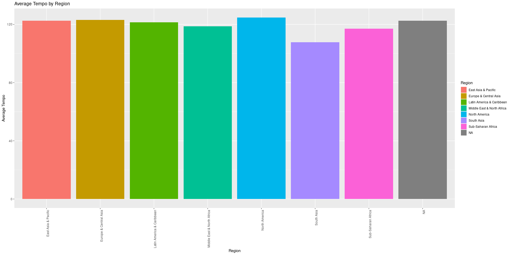
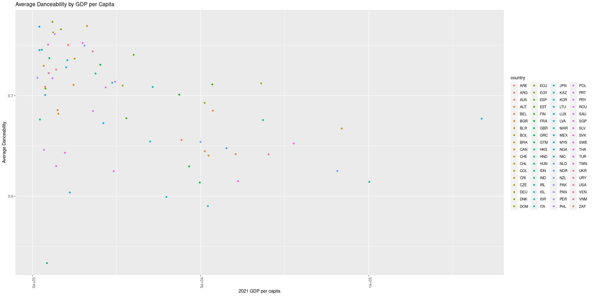
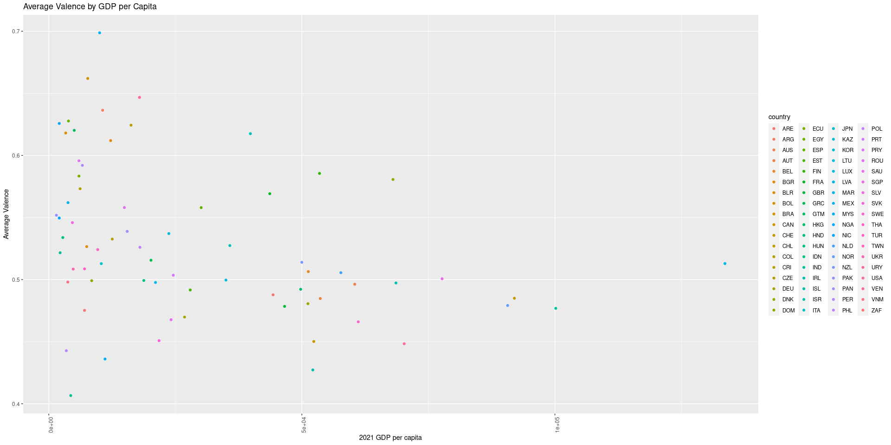
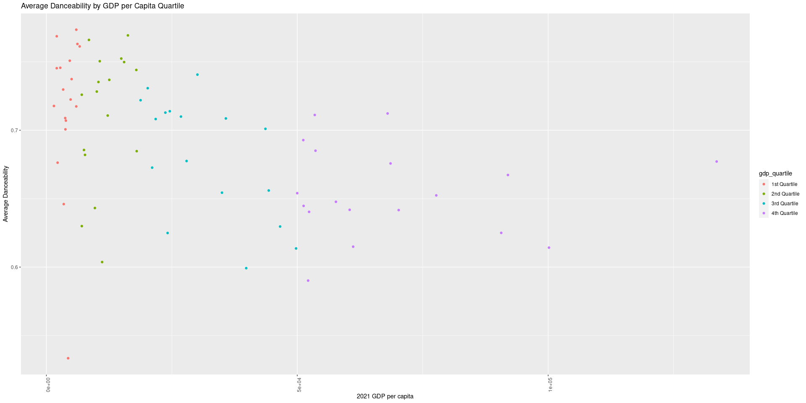
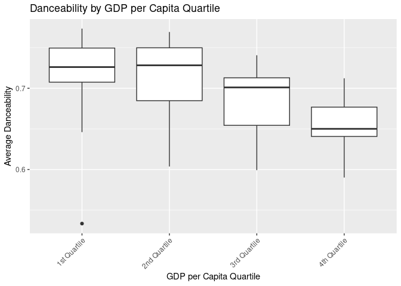

# Data Sources:

  - Spotify Data: Kaggle Spotify Countries dataset link:
    <https://www.kaggle.com/datasets/asaniczka/top-spotify-songs-in-73-countries-daily-updated/universal_top_spotify_songs.csv>
  - GDP Data: IMF Website

# DS 202 Final Project : Spotify Data by Country Analysis Using R

Authors: Logan Jorgensen, David Szczepanik, Devdatta Kasture

# Introduction

The goal of this report is to analyze Spotify’s listening data by
country/region, and see if there are any interesting trends or
correlations between the data and other sources. For our particular
report, we are comparing the Spotify listening data against the GDP of a
country, and investigating if there are any noticeable strong trends
between a country’s GDP and the music its people listen to. Although the
data we have does not include genre/subgenres, Spotify has a few metrics
it applies to each song in their database which can give us an
understanding of what kind of music is being listened to in a specific
country. We shall explore some of these metrics within our project
below.

# Data

## Importing Libraries Used in our Report

Down below are the libraries that we used within our investigation. We
used ggplot2 for data visualization, readxl for reading in our excel
sheet, dplyr for data manipulation and countrycode, which was used due
to a discrepancy in two-character and three-character country codes.

``` r
library(ggplot2)

install.packages("readxl", repos="https://cran.r-project.org")
library(readxl)
library(dplyr)

install.packages("countrycode", repos="https://cran.r-project.org")
library(countrycode)
```

## Importing the IMF GDP-by-Country Data

The GDP country data from the IMF website is made available in an excel
workbook (.xls) format. The following code extracted the data from the
sheet in the file called “Data”, and stored it in a dataframe called
imf\_data for our investigation. We made some adjustments to only
include the data that we needed, such as skipping the first three rows
of data that were not useful for our investigation, as can be seen
below.

``` r
# Read in the Excel file with the read_excel() function. The data desired is in the "Data" sheet. The first three rows are info for the user, so we skip them.
#  Column names are in the fourth row, so we set the col_names argument to TRUE.

imf_data <- read_excel("imf_data.xls", sheet = "Data", skip = 3, col_names = TRUE)

# View the first 6 rows of the data
```

## Filtering the IMF GDP-by-Country Data from the Excel Workbook

Once we had extracted the data from the excel workbook, we had a useable
dataframe to work off of. Our next step would be to prepare this
dataframe by cleaning the data and pre-processing the dataframe for a
merge with the spotify data in the future. We only used data from the
most recent year avaiable to study only the most recent information
available, which in this case was for the year 2021. We extracted the
data for each country for that respective year, and renamed the column
in our dataframe to 2021 GDP per capita for descriptiveness.

``` r
# The only columns we need are the `Country Code` and `2021` columns.
filtered_imf_gdp_data <- imf_data[, c("Country Code", "2021")]

# Next, we can rename the columns to be more descriptive (rename "2021" to "2021 GDP per capita")
colnames(filtered_imf_gdp_data) <- c("Country Code", "2021 GDP per capita")

# Display the first 6 rows of the filtered data
head(filtered_imf_gdp_data)
```

    ## # A tibble: 6 × 2
    ##   `Country Code` `2021 GDP per capita`
    ##   <chr>                          <dbl>
    ## 1 ABW                           29342.
    ## 2 AFE                            1539.
    ## 3 AFG                             364.
    ## 4 AFW                            1766.
    ## 5 AGO                            1904.
    ## 6 ALB                            6377.

## Combining Extra Metadeta from the IMF Excel Workbook

Within the same GDP Excel workbook from earlier, there was another sheet
named “Metadata - Countries”, which contained exactly what it is named -
the metadata for each country. It included the region, income level, any
special notes, and the full name for every country, which not only
provides more context to some of these countries, but could be also used
for further exploratory analysis. We took the metadata and stored it in
it’s own dataframe, before merging it with the dataframe above to create
one large dataframe of exactly the information we needed to move on:
Country Code, GDP per capita (2021), Region, Income Group, Special
Notes, and Table Name. We shall move on to the spotify data next.

``` r
# Read in the Excel file, this time from the sheet "Metadata - Countries"
imf_metadata <- read_excel("imf_data.xls", sheet = "Metadata - Countries")

# We want to merge the rows of the "Metadata - Countries" into the "filtered_imf_data" dataframe based on the "Country Code" column.
# We can use the left_join() function from the dplyr package to do this.

merged_imf_data <- left_join(filtered_imf_gdp_data, imf_metadata, by = "Country Code")

# Display the first 6 rows of the merged IMF data
head(merged_imf_data)
```

    ## # A tibble: 6 × 6
    ##   `Country Code` `2021 GDP per capita` Region IncomeGroup SpecialNotes TableName
    ##   <chr>                          <dbl> <chr>  <chr>       <chr>        <chr>    
    ## 1 ABW                           29342. Latin… High income  <NA>        Aruba    
    ## 2 AFE                            1539. <NA>   <NA>        "26 countri… Africa E…
    ## 3 AFG                             364. South… Low income  "The report… Afghanis…
    ## 4 AFW                            1766. <NA>   <NA>        "22 countri… Africa W…
    ## 5 AGO                            1904. Sub-S… Lower midd… "The World … Angola   
    ## 6 ALB                            6377. Europ… Upper midd…  <NA>        Albania

## Pulling in the Spotify Data

Now that the GDP data has been gathered, filtered, and made ready to
join the spotify data, we move on to doing the same thing for the
spotify data. The spotify dataset has been downloaded from Kaggle, and
is stored under the name “universal\_top\_spotify\_songs.csv”. We
started off by reading this data into a dataframe.

``` r
# Read in the Spotify data
spotify_data <- read.csv("universal_top_spotify_songs.csv")

# Display the first 6 rows of the Spotify data
head(spotify_data)
```

    ##               spotify_id                                                name
    ## 1 2KslE17cAJNHTsI2MI0jb2                                Standing Next to You
    ## 2 3rUGC1vUpkDG9CZFHMur1t                                              greedy
    ## 3 2HafqoJbgXdtjwCOvNEF14                                         Si No Estás
    ## 4 2HRgqmZQC0MC7GeNuDIXHN                 Seven (feat. Latto) (Explicit Ver.)
    ## 5 1Iq8oo9XkmmvCQiGOfORiz Is It Over Now? (Taylor's Version) (From The Vault)
    ## 6 7iQXYTyuG13aoeHxGG28Nh                                         PERRO NEGRO
    ##            artists daily_rank daily_movement weekly_movement country
    ## 1        Jung Kook          1              0              49        
    ## 2       Tate McRae          2              0               0        
    ## 3   iñigo quintero          3              0               0        
    ## 4 Jung Kook, Latto          4              0              46        
    ## 5     Taylor Swift          5              0              -4        
    ## 6  Bad Bunny, Feid          6              2              -1        
    ##   snapshot_date popularity is_explicit duration_ms
    ## 1    2023-11-09         91       False      206019
    ## 2    2023-11-09        100        True      131872
    ## 3    2023-11-09         99       False      184061
    ## 4    2023-11-09         82        True      183550
    ## 5    2023-11-09         93       False      229477
    ## 6    2023-11-09         97        True      162767
    ##                            album_name album_release_date danceability energy
    ## 1                              GOLDEN         2023-11-03        0.711  0.809
    ## 2                              greedy         2023-09-15        0.750  0.733
    ## 3                         Si No Estás         2022-09-23        0.537  0.421
    ## 4                              GOLDEN         2023-11-03        0.790  0.831
    ## 5             1989 (Taylor's Version)         2023-10-26        0.596  0.658
    ## 6 nadie sabe lo que va a pasar mañana         2023-10-13        0.911  0.778
    ##   key loudness mode speechiness acousticness instrumentalness liveness valence
    ## 1   2   -4.389    0      0.0955       0.0447         0.00e+00   0.3390   0.816
    ## 2   6   -3.180    0      0.0319       0.2560         0.00e+00   0.1140   0.844
    ## 3   5   -8.720    1      0.0285       0.8270         0.00e+00   0.1380   0.524
    ## 4  11   -4.185    1      0.0440       0.3120         0.00e+00   0.0797   0.872
    ## 5   0   -7.346    1      0.0360       0.0504         0.00e+00   0.1270   0.176
    ## 6   5   -2.248    1      0.2620       0.0887         2.16e-05   0.1790   0.345
    ##     tempo time_signature
    ## 1 106.017              4
    ## 2 111.018              1
    ## 3  98.224              4
    ## 4 124.987              4
    ## 5 100.012              4
    ## 6  96.057              4

## Dealing With Inconsistent Country Code Data

This is where we came across an issue that required the countrycode
library. There was a discrepancy between the two datasets: the IMF
dataset uses Alpha-3 ISO codes for countries, while the Spotify dataset
uses Alpha-2 ISO codes. Below we convert both the Alpha-3 codes, and the
Alpha-2 codes, all to their country names using the library. This
ensured we have the country names associated to the data going forward
in our exploration, rather than country codes.

``` r
# Convert the Alpha-2 codes in the Spotify data `country` column to Alpha-3 codes to match the IMF data in a new dataframe copy of the Spotify data
spotify_data_alpha3 <- spotify_data %>%
  mutate(country = countrycode(country, "iso2c", "iso3c"))
```

    ## Warning: There was 1 warning in `mutate()`.
    ## ℹ In argument: `country = countrycode(country, "iso2c", "iso3c")`.
    ## Caused by warning:
    ## ! Some values were not matched unambiguously:

## Joining the IMF and Spotify Data

Now that we’ve converted the country codes in the Spotify (when
possible) to match the IMF data, we should be able to join the two
datasets.

### Checking for Overlapping Country Codes

We checked to see if there were any matches between the country codes
between the two datasets. As you can see below, we have valid workable
data between 71 countries, more than enough to explore possible
coorelations.

``` r
# Show the country codes that overlap between spotify_data_alpha3's `country` column and merged_imf_data's `Country Code` column
intersect(spotify_data_alpha3$country, merged_imf_data$`Country Code`)
```

    ##  [1] "ZAF" "VNM" "VEN" "URY" "USA" "UKR" "TUR" "THA" "SLV" "SVK" "SGP" "SWE"
    ## [13] "SAU" "ROU" "PRY" "PRT" "POL" "PAK" "PHL" "PER" "PAN" "NZL" "NOR" "NLD"
    ## [25] "NIC" "NGA" "MYS" "MEX" "MAR" "LVA" "LUX" "LTU" "KAZ" "KOR" "JPN" "ITA"
    ## [37] "ISL" "IND" "ISR" "IRL" "IDN" "HUN" "HND" "HKG" "GTM" "GRC" "GBR" "FRA"
    ## [49] "FIN" "ESP" "EGY" "EST" "ECU" "DOM" "DNK" "DEU" "CZE" "CRI" "COL" "CHL"
    ## [61] "CHE" "CAN" "BLR" "BRA" "BOL" "BGR" "BEL" "AUS" "AUT" "ARG" "ARE"

### Joining the Two Datasets on the Country Code

Based on the output from above, we were able to join the two datasets on
the `Country Code` from the GDP dataframe and `country` from the Spotify
dataframe, to create one big dataframe for our project. This concludes
our data cleaning, and move on to exploring the merged data and
beginning to study the results.

``` r
# Code to join the two datasets on the `Country Code` and `country` columns, and store the result in a new dataframe called `joined_data`.
joined_data <- left_join(spotify_data_alpha3, merged_imf_data, by = c("country" = "Country Code"))

# Remove any data where the `country` column is <NA>
cleaned_joined_data <- joined_data[!is.na(joined_data$country), ]

# Show the first 6 rows of the joined data
head(cleaned_joined_data)
```

    ##                spotify_id
    ## 51 5yyYL1FpimADTIftYQU0cg
    ## 52 5C9h6ZyskUiyAVDmhSfSdP
    ## 53 7JbLSEDlRdoJaXk5ddZae2
    ## 54 6Kijtp0DB6VwcoJIw7PJ9W
    ## 55 4URabg9AGHasjFEVdTbWcC
    ## 56 5aIVCx5tnk0ntmdiinnYvw
    ##                                                                               name
    ## 51                                                                           iPlan
    ## 52                                               Imnandi lento (feat. Tman Xpress)
    ## 53                                                                           Paris
    ## 54 Imithandazo (feat. Young Stunna, DJ Maphorisa, Sizwe Alakine & Umthakathi Kush)
    ## 55                                                        Dalie (feat. Baby S.O.N)
    ## 56                                                                           Water
    ##                                                                                artists
    ## 51                                                          Dlala Thukzin, Zaba, Sykes
    ## 52                                 Mellow & Sleazy, SjavasDaDeejay, TitoM, Tman Xpress
    ## 53                                                        Mthandeni SK, Lwah Ndlunkulu
    ## 54 Kabza De Small, Mthunzi, DJ Maphorisa, Young Stunna, Sizwe Alakine, Umthakathi Kush
    ## 55                                 Kamo Mphela, Tyler ICU, Khalil Harrison, Baby S.O.N
    ## 56                                                                                Tyla
    ##    daily_rank daily_movement weekly_movement country snapshot_date popularity
    ## 51          1              0               0     ZAF    2023-11-09         68
    ## 52          2              0               0     ZAF    2023-11-09         70
    ## 53          3              0               2     ZAF    2023-11-09         64
    ## 54          4              4               5     ZAF    2023-11-09         59
    ## 55          5             -1              -2     ZAF    2023-11-09         46
    ## 56          6              0              -2     ZAF    2023-11-09         95
    ##    is_explicit duration_ms                        album_name album_release_date
    ## 51       False      410847                 Permanent Music 3         2023-09-15
    ## 52       False      447834 Imnandi lento (feat. Tman Xpress)         2023-08-18
    ## 53       False      257959                             Paris         2023-08-09
    ## 54       False      351200                             Isimo         2023-10-27
    ## 55       False      280424          Dalie (feat. Baby S.O.N)         2023-10-11
    ## 56       False      200255                             Water         2023-07-28
    ##    danceability energy key loudness mode speechiness acousticness
    ## 51        0.697  0.643   5  -10.253    0      0.0384      0.07090
    ## 52        0.861  0.524   6  -13.325    0      0.0667      0.06000
    ## 53        0.619  0.903   1   -4.659    1      0.0693      0.02960
    ## 54        0.806  0.767   6   -9.686    0      0.1120      0.17900
    ## 55        0.831  0.568   1   -9.984    1      0.0515      0.00005
    ## 56        0.673  0.722   3   -3.495    0      0.0755      0.08560
    ##    instrumentalness liveness valence   tempo time_signature 2021 GDP per capita
    ## 51         0.584000   0.1010   0.748 118.004              4            7055.055
    ## 52         0.000776   0.0231   0.632 111.982              4            7055.055
    ## 53         0.001990   0.1900   0.964 154.639              4            7055.055
    ## 54         0.001260   0.1820   0.795 113.001              4            7055.055
    ## 55         0.090100   0.1220   0.160 113.009              4            7055.055
    ## 56         0.000000   0.1370   0.519 117.187              4            7055.055
    ##                Region         IncomeGroup
    ## 51 Sub-Saharan Africa Upper middle income
    ## 52 Sub-Saharan Africa Upper middle income
    ## 53 Sub-Saharan Africa Upper middle income
    ## 54 Sub-Saharan Africa Upper middle income
    ## 55 Sub-Saharan Africa Upper middle income
    ## 56 Sub-Saharan Africa Upper middle income
    ##                                                                   SpecialNotes
    ## 51 Fiscal year end: March 31; reporting period for national accounts data: CY.
    ## 52 Fiscal year end: March 31; reporting period for national accounts data: CY.
    ## 53 Fiscal year end: March 31; reporting period for national accounts data: CY.
    ## 54 Fiscal year end: March 31; reporting period for national accounts data: CY.
    ## 55 Fiscal year end: March 31; reporting period for national accounts data: CY.
    ## 56 Fiscal year end: March 31; reporting period for national accounts data: CY.
    ##       TableName
    ## 51 South Africa
    ## 52 South Africa
    ## 53 South Africa
    ## 54 South Africa
    ## 55 South Africa
    ## 56 South Africa

<!-- Another sample / test just to explore the joined data -->

``` r
# Display the first 6 rows of the joined data for `country`, `2021 GDP per capita` and `artists` columns to show that the join merged the data correctly
head(cleaned_joined_data[, c("country", "2021 GDP per capita", "artists")])
```

    ##    country 2021 GDP per capita
    ## 51     ZAF            7055.055
    ## 52     ZAF            7055.055
    ## 53     ZAF            7055.055
    ## 54     ZAF            7055.055
    ## 55     ZAF            7055.055
    ## 56     ZAF            7055.055
    ##                                                                                artists
    ## 51                                                          Dlala Thukzin, Zaba, Sykes
    ## 52                                 Mellow & Sleazy, SjavasDaDeejay, TitoM, Tman Xpress
    ## 53                                                        Mthandeni SK, Lwah Ndlunkulu
    ## 54 Kabza De Small, Mthunzi, DJ Maphorisa, Young Stunna, Sizwe Alakine, Umthakathi Kush
    ## 55                                 Kamo Mphela, Tyler ICU, Khalil Harrison, Baby S.O.N
    ## 56                                                                                Tyla

## <!-- End of Data Cleaning and Preprocessing -->

<!-- Beginning of Data Exploration and Analysis -->

# Data Exploration and Analysis

Below is an example of how we can extract and analyze data from our new
dataframe; We can not only quickly create a dataframe to hold the most
popular song in the country with the code ZAF, but display it and chart
it all within the same group of code. This is how we will explore the
data further into our report.

``` r
# For the data in each row with `country` equal to "ZAF" with the `daily rank` column equal to 1, show the `name` and `snapshot_date` column
zaf_most_popular_song <- cleaned_joined_data %>%
  filter(country == "ZAF" & daily_rank == 1) %>%
  select(name, snapshot_date)

# Display the first 6 rows of the data
head(zaf_most_popular_song)
```

    ##                                name snapshot_date
    ## 1                             iPlan    2023-11-09
    ## 2                             iPlan    2023-11-08
    ## 3                             iPlan    2023-11-07
    ## 4 Imnandi lento (feat. Tman Xpress)    2023-11-06
    ## 5                             iPlan    2023-11-05
    ## 6                             iPlan    2023-11-04

``` r
# Create a visual that counts how many times each song was the most popular song in ZAF
ggplot(zaf_most_popular_song, aes(x = name)) +
  geom_bar() +
  theme(axis.text.x = element_text(angle = 90, hjust = 1)) +
  labs(x = "Song Name", y = "Number of Days as Most Popular Song", title = "Most Popular Song in ZAF by Day")
```

<!-- -->

## Number of Explicit vs. Non-Explicit Song Appearances by Country

Our first investigation was to compare how many explicit
vs. non-explicit songs each country listens to. We wanted to explore if
there would be a correlation between a country’s GDP and explicitness of
the music a country listens to. The first visual below, as you can
probably tell, was very hard to look at, so we ended up creating a
second visual which included the same data, but rather than displaying
both the number of explicit and non-explicit songs, we ended up only
displaying the percentage of explicit songs over the count of total
songs for each country. We also colored in the bar for the United States
for visual purposes.

``` r
# We can create a new dataframe that counts the number of explicit and non-explicit songs for each country (true or false in is_explicit column). Exlcude entries with country value of <NA>.
explicit_vs_non_explicit <- cleaned_joined_data %>%
  filter(!is.na(country)) %>%
  group_by(country, is_explicit) %>%
  summarise(count = n())
```

    ## `summarise()` has grouped output by 'country'. You can override using the
    ## `.groups` argument.

``` r
# Display the first 6 rows of the data
head(explicit_vs_non_explicit)
```

    ## # A tibble: 6 × 3
    ## # Groups:   country [3]
    ##   country is_explicit count
    ##   <chr>   <chr>       <int>
    ## 1 ARE     False         733
    ## 2 ARE     True          420
    ## 3 ARG     False         743
    ## 4 ARG     True          407
    ## 5 AUS     False         749
    ## 6 AUS     True          403

``` r
# Then, we create a visual that shows the number of explicit and non-explicit songs for each country
ggplot(explicit_vs_non_explicit, aes(x = country, y = count, fill = is_explicit)) +
  geom_bar(stat = "identity", position = "dodge") +
  theme(axis.text.x = element_text(angle = 90, hjust = 1)) +
  labs(x = "Country", y = "Number of Songs", title = "Number of Explicit vs. Non-Explicit Songs by Country")
```

<!-- -->

``` r
# We can add a new column that represents the percentage of songs that are explicit for each country
explicit_percent_by_country <- explicit_vs_non_explicit %>%
  group_by(country) %>%
  mutate(percent = count / sum(count) * 100)

# Then, we create a visual that shows the percentage column value, where the y axis is the percentage of songs that are explicit for each country and the x axis is the country.
# The column that has the country value of "USA" should have it's bar colored red.

ggplot(explicit_percent_by_country, aes(x = country, y = percent, fill = country)) +
  geom_bar(stat = "identity", position = "dodge") +
  theme(axis.text.x = element_text(angle = 90, hjust = 1)) +
  labs(x = "Country", y = "Percentage of Songs that are Explicit", title = "Percentage of Explicit Songs by Country") +
  scale_fill_manual(values = c("USA" = "darkred"))
```

<!-- -->

## Tempo by Country

After exploring the explicitness data per country, we moved onto the
average tempo of the top music per country. Generally speaking, songs
with a higher tempo are often times more upbeat and share positive
characteristics, while slower tempo music is often more relaxed and
share neutral/negative characteristics. This is an excellent metric to
study trends in music per country. Again, as was the case above, the
chart was very hard to read, so we categorized the same tempo data by
the region of each country and averaged them out over each region
instead.

``` r
# We can create a new dataframe that calculates the average tempo for each country with it's region value. Excluding entries with country value of <NA>.
tempo_by_country <- cleaned_joined_data %>%
  filter(!is.na(country)) %>%
  group_by(country, Region) %>%
  summarise(avg_tempo = mean(tempo))
```

    ## `summarise()` has grouped output by 'country'. You can override using the
    ## `.groups` argument.

``` r
# Then, we create a visual that shows the average tempo for each country
# Color the bar for the country based on it's `Region` value using fill
ggplot(tempo_by_country, aes(x = country, y = avg_tempo, fill = Region)) +
  geom_bar(stat = "identity", position = "dodge") +
  theme(axis.text.x = element_text(angle = 90, hjust = 1)) +
  labs(x = "Country", y = "Average Tempo", title = "Average Tempo by Country")
```

<!-- -->

## Tempo by Region

``` r
# We can create a new dataframe that calculates the average tempo for each region. Exlcuding entries with country value of <NA>.
tempo_by_region <- cleaned_joined_data %>%
  filter(!is.na(country)) %>%
  group_by(Region) %>%
  summarise(avg_tempo = mean(tempo))

# Then, we create a visual that shows the average tempo for each region, colored by region
ggplot(tempo_by_region, aes(x = Region, y = avg_tempo, fill = Region)) +
  geom_bar(stat = "identity", position = "dodge") +
  theme(axis.text.x = element_text(angle = 90, hjust = 1)) +
  labs(x = "Region", y = "Average Tempo", title = "Average Tempo by Region")
```

<!-- -->

## Danceability by GDP per Capita

We can also explore one of Spotify’s custom song metrics for
coorrelation between GDP and listening trends. Danceability, according
to Spotify’s API, describes how suitable a track is for dancing based on
a combination of musical elements. We kept Danceability on our report
due to a bunch of repetition in results, but we also explored energy,
speechiness, and acousticness to extremely similar results, and decided
to omit for conciseness. Below is a chart that compares the Danceability
metric against GDP.

``` r
# We need get the average of danceability and the average "2021 GDP per capita" for each country. Excluding entries with country value of <NA>. Then we will plot the data as a scatterplot, with the x-axis being the average "2021 GDP per capita" and the y-axis being the average danceability.
danceability_and_gdp_by_country <- cleaned_joined_data %>%
  filter(!is.na(country)) %>%
  group_by(country) %>%
  summarise(avg_danceability = mean(danceability), avg_gdp = mean(`2021 GDP per capita`))

# Then, we create a visual that shows the average danceability for each country, colored by region
ggplot(danceability_and_gdp_by_country, aes(x = avg_gdp, y = avg_danceability, color = country)) +
  geom_point() +
  theme(axis.text.x = element_text(angle = 90, hjust = 1)) +
  labs(x = "2021 GDP per capita", y = "Average Danceability", title = "Average Danceability by GDP per Capita")
```

    ## Warning: Removed 2 rows containing missing values (`geom_point()`).

<!-- -->

## Danceability by GDP per Capity Quartile

Building off of our Danceability investigation above, we furthered our
exploration by dividing the GDP into quartiles, and created two charts
based off of the quartile split rather than GDP value itself. Although
the scatter plot is identical to the one above, the box plot which was
not available to us before dividing up the GDP into quartiles gives us
an insight to some coorrelation that no one expected. More on this in
Results.

``` r
danceability_and_gdp_by_country <- cleaned_joined_data %>%
  filter(!is.na(country) & !is.na(`2021 GDP per capita`)) %>%
  group_by(country) %>%
  summarise(avg_danceability = mean(danceability, na.rm = TRUE), 
            avg_gdp = mean(`2021 GDP per capita`, na.rm = TRUE))

# Calculate quartiles for GDP per capita
gdp_quartiles <- quantile(danceability_and_gdp_by_country$avg_gdp, probs = c(0.25, 0.5, 0.75), na.rm = TRUE)

# Add a new column for GDP quartiles
danceability_and_gdp_by_country$gdp_quartile <- cut(danceability_and_gdp_by_country$avg_gdp, 
                                                    breaks = c(-Inf, gdp_quartiles, Inf), 
                                                    labels = c("1st Quartile", "2nd Quartile", "3rd Quartile", "4th Quartile"),
                                                    include.lowest = TRUE)

# Scatterplot colored by GDP quartile
ggplot(danceability_and_gdp_by_country, aes(x = avg_gdp, y = avg_danceability, color = gdp_quartile)) +
  geom_point() +
  theme(axis.text.x = element_text(angle = 90, hjust = 1)) +
  labs(x = "2021 GDP per capita", y = "Average Danceability", title = "Average Danceability by GDP per Capita Quartile")
```

<!-- -->

``` r
# Create box plots for each GDP quartile
ggplot(danceability_and_gdp_by_country, aes(x = gdp_quartile, y = avg_danceability)) +
  geom_boxplot() +
  labs(x = "GDP per Capita Quartile", y = "Average Danceability", title = "Danceability by GDP per Capita Quartile") +
  theme(axis.text.x = element_text(angle = 45, hjust = 1))
```

<!-- -->

## Valance by GDP per Capita

We decided to plot Valance over GDP as well to include a metric that had
a visible difference from Danceability. Valance, according to the
Spotify API, is a measure from 0 to 100 describing the musical
positiveness conveyed by a track. Again, it’s a metric developed by
Spotify, but it can be explored just as all the other ones.

``` r
# Now, we do the same thing as above, but instead of danceability, we use valence
valence_and_gdp_by_country <- cleaned_joined_data %>%
  filter(!is.na(country)) %>%
  group_by(country) %>%
  summarise(avg_valence = mean(valence), avg_gdp = mean(`2021 GDP per capita`))

# Then, we create a visual that shows the average valence for each country, colored by region
ggplot(valence_and_gdp_by_country, aes(x = avg_gdp, y = avg_valence, color = country)) +
  geom_point() +
  theme(axis.text.x = element_text(angle = 90, hjust = 1)) +
  labs(x = "2021 GDP per capita", y = "Average Valence", title = "Average Valence by GDP per Capita")
```

    ## Warning: Removed 2 rows containing missing values (`geom_point()`).

<!-- -->

# Results

After exploring the data using our methods above, we found some
incredible things that no one in our group expected.

Starting off from the Percentage of Explicit Songs by Country bar chart,
we were originally caught off-guard by how low the percentage of
explicit music was for the United States compared to the rest of the
world. It clicked when we took into consideration the volume of music
that is created in the United States, both explicit and non-explicit,
that helped justify the lower than average percentage. We were also
slightly blown away that India had approximately 100% of it’s listening
trends labelled as explicit.

Looking at Tempo by Country didn’t give us exactly concrete information
to work off of, but Logan’s idea of splitting up the data from
country-based to region-based gave us one key outlier, and something to
keep in mind going forward with the rest of the regions. The key
outlier, South Asia, averaged a tempo of roughly 110 Beats per Minute,
way lower than the 120 Beats per Minute that every other region hovered
around. This could be used further to investigate whether there is a
cultural influence in that region which leads to listening trends of
slower music, such as genre preference or enjoyment of music.

The greatest shock from this project can be located in the Average
Danceability by GDP per Capita plot. As a team, we were not really
expecting a strong coorrelation between music and GDP, but we were all
taken by surprise when we saw the strong correlation between the
danceability of a song and GDP. We can confidently present that there is
a strong coorrelation between a higher danceability and lower GDP, which
is further established by the boxplot we created when splitting the data
into quartiles. The first and second quartiles were above a score of
0.7, while third was at 0.7 and fourth was closer to 0.6 than 0.7. The
same trends were followed by energy, speechiness, and acousticness
metrics.

The last chart we created compared Valance to GDP. We included this
chart to show that some music metrics do not seem to be influenced by
GDP. It can be noted that higher GDP has lower average valence but even
at lower GDP, the results are so scattered we can confidently say there
is no coorrelation between Valance (musical positiveness) and GDP.

# Conclusion

After exploring the data and concluding that there are some variables in
music that are influenced by GDP, this leaves us in an excellent
position moving forward. As stated earlier, some variables such as
danceability, energy, etc. are influenced by GDP, which can be used to
further our exploration. However, some things need to be addressed
before furthering our studies; Countries with low GDP tend to be
dominated by one artist, and some variables are not influenced by GDP.
Some studies could be done to examine the music industries in lower GDP
countries, and more data never hurts to have regarding the Spotify
metrics that we examined earlier. Perhaps as more data becomes
available, some data may begin to smooth out coorrelations or create new
ones. If we were to continue working on this investigation, we would
begin by simplifying the data into region-based analysis, and perhaps
examining how Spotify recommends new music to its users or how music is
being created in countries with differing economic stature. Overall, we
were more than pleased to discover there is some coorrelation, and more
than proud of the work we had done to reach our conclusion.
