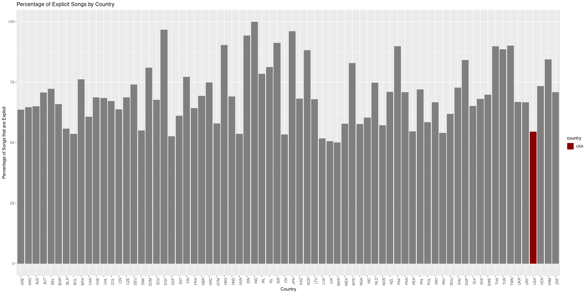

# Data Sources:

  - Spotify Data: Kaggle Spotify Countries dataset link:
    <https://www.kaggle.com/datasets/asaniczka/top-spotify-songs-in-73-countries-daily-updated/universal_top_spotify_songs.csv>
  - GDP Data: IMF Website

# DS 202 Final Project

## Spotify Data by Country Analysis Using R

The goal of this project is to analyze the Spotify data by country, and
see if there are any interesting trends or correlations between the data
and other data sources.

For example, we could see if there is a correlation between a country’s
GDP and the popularity of a certain genre of music in that country.

-----

``` r
library(ggplot2) # Used for data visualization
library(readxl) # Used for reading in Excel files
library(dplyr) # Used for data manipulation

# Install and load the countrycode package, which will be used to convert between country codes (why this is needed is explained later in the project)
install.packages("countrycode", repos="https://cran.r-project.org")
library(countrycode)
```

-----

## Importing the IMF GDP-by-Country Data

There is data stored in an Excel workbook file titled “imf\_data.xls”.
Below, we will extract the data from the “Data” sheet of the workbook,
and store it in a dataframe.

``` r
# Read in the Excel file with the read_excel() function. The data desired is in the "Data" sheet. The first three rows are info for the user, so we skip them.
#  Column names are in the fourth row, so we set the col_names argument to TRUE.

imf_data <- read_excel("imf_data.xls", sheet = "Data", skip = 3, col_names = TRUE)

# View the first 6 rows of the data
head(imf_data)
```

    ## # A tibble: 6 × 67
    ##   `Country Name`  `Country Code` `Indicator Name` `Indicator Code` `1960` `1961`
    ##   <chr>           <chr>          <chr>            <chr>             <dbl>  <dbl>
    ## 1 Aruba           ABW            GDP per capita … NY.GDP.PCAP.CD     NA     NA  
    ## 2 Africa Eastern… AFE            GDP per capita … NY.GDP.PCAP.CD    162.   161. 
    ## 3 Afghanistan     AFG            GDP per capita … NY.GDP.PCAP.CD     62.4   62.4
    ## 4 Africa Western… AFW            GDP per capita … NY.GDP.PCAP.CD    107.   113. 
    ## 5 Angola          AGO            GDP per capita … NY.GDP.PCAP.CD     NA     NA  
    ## 6 Albania         ALB            GDP per capita … NY.GDP.PCAP.CD     NA     NA  
    ## # ℹ 61 more variables: `1962` <dbl>, `1963` <dbl>, `1964` <dbl>, `1965` <dbl>,
    ## #   `1966` <dbl>, `1967` <dbl>, `1968` <dbl>, `1969` <dbl>, `1970` <dbl>,
    ## #   `1971` <dbl>, `1972` <dbl>, `1973` <dbl>, `1974` <dbl>, `1975` <dbl>,
    ## #   `1976` <dbl>, `1977` <dbl>, `1978` <dbl>, `1979` <dbl>, `1980` <dbl>,
    ## #   `1981` <dbl>, `1982` <dbl>, `1983` <dbl>, `1984` <dbl>, `1985` <dbl>,
    ## #   `1986` <dbl>, `1987` <dbl>, `1988` <dbl>, `1989` <dbl>, `1990` <dbl>,
    ## #   `1991` <dbl>, `1992` <dbl>, `1993` <dbl>, `1994` <dbl>, `1995` <dbl>, …

## Filtering the IMF GDP-by-Country Data from the Excel Workbook

We are aiming to join this GDP data into our Spotify data. We will need
to do some data cleaning / preprocessing first.

``` r
# The only columns we need are the `Country Code` and `2021` columns.
filtered_imf_gdp_data <- imf_data[, c("Country Code", "2021")]

# Next, we can rename the columns to be more descriptive (rename "2021" to "2021 GDP per capita")
colnames(filtered_imf_gdp_data) <- c("Country Code", "2021 GDP per capita")

# Display the first 6 rows of the filtered data
head(filtered_imf_gdp_data)
```

    ## # A tibble: 6 × 2
    ##   `Country Code` `2021 GDP per capita`
    ##   <chr>                          <dbl>
    ## 1 ABW                           29342.
    ## 2 AFE                            1539.
    ## 3 AFG                             364.
    ## 4 AFW                            1766.
    ## 5 AGO                            1904.
    ## 6 ALB                            6377.

## Combining Extra Metadeta from the IMF Excel Workbook

Within the Excel workbook from the IMF, there is another sheet titled
“Metadata - Countries” that contains metadata for each country. We can
add this data to the filtered data to provide more context.

``` r
# Read in the Excel file, this time from the sheet "Metadata - Countries"
imf_metadata <- read_excel("imf_data.xls", sheet = "Metadata - Countries")

# We want to merge the rows of the "Metadata - Countries" into the "filtered_imf_data" dataframe based on the "Country Code" column.
# We can use the left_join() function from the dplyr package to do this.

merged_imf_data <- left_join(filtered_imf_gdp_data, imf_metadata, by = "Country Code")

# Display the first 6 rows of the merged IMF data
head(merged_imf_data)
```

    ## # A tibble: 6 × 6
    ##   `Country Code` `2021 GDP per capita` Region IncomeGroup SpecialNotes TableName
    ##   <chr>                          <dbl> <chr>  <chr>       <chr>        <chr>    
    ## 1 ABW                           29342. Latin… High income  <NA>        Aruba    
    ## 2 AFE                            1539. <NA>   <NA>        "26 countri… Africa E…
    ## 3 AFG                             364. South… Low income  "The report… Afghanis…
    ## 4 AFW                            1766. <NA>   <NA>        "22 countri… Africa W…
    ## 5 AGO                            1904. Sub-S… Lower midd… "The World … Angola   
    ## 6 ALB                            6377. Europ… Upper midd…  <NA>        Albania

## Pulling in the Spotify Data

Now that the data is gathered and filtered from the original IMF Excel
workbook, it should be ready to be joined into the main Spotify data.

The Spotify dataset has been downloaded from Kaggle and added to this
project, and is stored in the file “universal\_top\_spotify\_songs.csv”.
We can read this data into a dataframe using the read.csv() function.

``` r
# Read in the Spotify data
spotify_data <- read.csv("universal_top_spotify_songs.csv")

# Display the first 6 rows of the Spotify data
head(spotify_data)
```

    ##               spotify_id                                                name
    ## 1 2KslE17cAJNHTsI2MI0jb2                                Standing Next to You
    ## 2 3rUGC1vUpkDG9CZFHMur1t                                              greedy
    ## 3 2HafqoJbgXdtjwCOvNEF14                                         Si No Estás
    ## 4 2HRgqmZQC0MC7GeNuDIXHN                 Seven (feat. Latto) (Explicit Ver.)
    ## 5 1Iq8oo9XkmmvCQiGOfORiz Is It Over Now? (Taylor's Version) (From The Vault)
    ## 6 7iQXYTyuG13aoeHxGG28Nh                                         PERRO NEGRO
    ##            artists daily_rank daily_movement weekly_movement country
    ## 1        Jung Kook          1              0              49        
    ## 2       Tate McRae          2              0               0        
    ## 3   iñigo quintero          3              0               0        
    ## 4 Jung Kook, Latto          4              0              46        
    ## 5     Taylor Swift          5              0              -4        
    ## 6  Bad Bunny, Feid          6              2              -1        
    ##   snapshot_date popularity is_explicit duration_ms
    ## 1    2023-11-09         91       False      206019
    ## 2    2023-11-09        100        True      131872
    ## 3    2023-11-09         99       False      184061
    ## 4    2023-11-09         82        True      183550
    ## 5    2023-11-09         93       False      229477
    ## 6    2023-11-09         97        True      162767
    ##                            album_name album_release_date danceability energy
    ## 1                              GOLDEN         2023-11-03        0.711  0.809
    ## 2                              greedy         2023-09-15        0.750  0.733
    ## 3                         Si No Estás         2022-09-23        0.537  0.421
    ## 4                              GOLDEN         2023-11-03        0.790  0.831
    ## 5             1989 (Taylor's Version)         2023-10-26        0.596  0.658
    ## 6 nadie sabe lo que va a pasar mañana         2023-10-13        0.911  0.778
    ##   key loudness mode speechiness acousticness instrumentalness liveness valence
    ## 1   2   -4.389    0      0.0955       0.0447         0.00e+00   0.3390   0.816
    ## 2   6   -3.180    0      0.0319       0.2560         0.00e+00   0.1140   0.844
    ## 3   5   -8.720    1      0.0285       0.8270         0.00e+00   0.1380   0.524
    ## 4  11   -4.185    1      0.0440       0.3120         0.00e+00   0.0797   0.872
    ## 5   0   -7.346    1      0.0360       0.0504         0.00e+00   0.1270   0.176
    ## 6   5   -2.248    1      0.2620       0.0887         2.16e-05   0.1790   0.345
    ##     tempo time_signature
    ## 1 106.017              4
    ## 2 111.018              1
    ## 3  98.224              4
    ## 4 124.987              4
    ## 5 100.012              4
    ## 6  96.057              4

## Dealing With Inconsistent Country Code Data

There is a discrepency between the two datasets: the IMF dataset uses
Alpha-3 ISO codes for countries, while the Spotify dataset uses Alpha-2
ISO codes. We will need to convert the Alpha-3 codes and Alpha-2 codes
to the actual country names, and then join the two datasets.

``` r
# Convert the Alpha-2 codes in the Spotify data `country` column to Alpha-3 codes to match the IMF data in a new dataframe copy of the Spotify data
spotify_data_alpha3 <- spotify_data %>%
  mutate(country = countrycode(country, "iso2c", "iso3c"))
```

    ## Warning: There was 1 warning in `mutate()`.
    ## ℹ In argument: `country = countrycode(country, "iso2c", "iso3c")`.
    ## Caused by warning:
    ## ! Some values were not matched unambiguously:

``` r
# Display the first 6 unique values in the `country` column of the Spotify data that aren't <NA>
unique(spotify_data_alpha3$country, incomparables = FALSE)
```

    ##  [1] NA    "ZAF" "VNM" "VEN" "URY" "USA" "UKR" "TWN" "TUR" "THA" "SLV" "SVK"
    ## [13] "SGP" "SWE" "SAU" "ROU" "PRY" "PRT" "POL" "PAK" "PHL" "PER" "PAN" "NZL"
    ## [25] "NOR" "NLD" "NIC" "NGA" "MYS" "MEX" "MAR" "LVA" "LUX" "LTU" "KAZ" "KOR"
    ## [37] "JPN" "ITA" "ISL" "IND" "ISR" "IRL" "IDN" "HUN" "HND" "HKG" "GTM" "GRC"
    ## [49] "GBR" "FRA" "FIN" "ESP" "EGY" "EST" "ECU" "DOM" "DNK" "DEU" "CZE" "CRI"
    ## [61] "COL" "CHL" "CHE" "CAN" "BLR" "BRA" "BOL" "BGR" "BEL" "AUS" "AUT" "ARG"
    ## [73] "ARE"

## Joining the IMF and Spotify Data

Now that we’ve converted the country codes in the Spotify (when
possible) to match the IMF data, we should be able to join the two
datasets.

### Checking for Overlapping Country Codes

First, it’s probably a good idea to check that the country codes in the
two datasets match up. We can do this by checking for any country codes
that are in both datasets:

``` r
# Show the country codes that overlap between spotify_data_alpha3's `country` column and merged_imf_data's `Country Code` column
intersect(spotify_data_alpha3$country, merged_imf_data$`Country Code`)
```

    ##  [1] "ZAF" "VNM" "VEN" "URY" "USA" "UKR" "TUR" "THA" "SLV" "SVK" "SGP" "SWE"
    ## [13] "SAU" "ROU" "PRY" "PRT" "POL" "PAK" "PHL" "PER" "PAN" "NZL" "NOR" "NLD"
    ## [25] "NIC" "NGA" "MYS" "MEX" "MAR" "LVA" "LUX" "LTU" "KAZ" "KOR" "JPN" "ITA"
    ## [37] "ISL" "IND" "ISR" "IRL" "IDN" "HUN" "HND" "HKG" "GTM" "GRC" "GBR" "FRA"
    ## [49] "FIN" "ESP" "EGY" "EST" "ECU" "DOM" "DNK" "DEU" "CZE" "CRI" "COL" "CHL"
    ## [61] "CHE" "CAN" "BLR" "BRA" "BOL" "BGR" "BEL" "AUS" "AUT" "ARG" "ARE"

### Joining the Two Datasets on the Country Code

Based on this output, we should be able to join the two datasets on the
`Country Code` in merged\_imf\_data and `country` in
spotify\_data\_alpha3.

``` r
# Code to join the two datasets on the `Country Code` and `country` columns, and store the result in a new dataframe called `joined_data`.
joined_data <- left_join(spotify_data_alpha3, merged_imf_data, by = c("country" = "Country Code"))

# Remove any data where the `country` column is <NA>
cleaned_joined_data <- joined_data[!is.na(joined_data$country), ]

# Show the first 6 rows of the joined data
# head(cleaned_joined_data)

# Display the first 6 rows of the joined data for `country`, `2021 GDP per capita` and `artists` columns to show that the join merged the data correctly
head(cleaned_joined_data[, c("country", "2021 GDP per capita", "artists")])
```

    ##    country 2021 GDP per capita
    ## 51     ZAF            7055.055
    ## 52     ZAF            7055.055
    ## 53     ZAF            7055.055
    ## 54     ZAF            7055.055
    ## 55     ZAF            7055.055
    ## 56     ZAF            7055.055
    ##                                                                                artists
    ## 51                                                          Dlala Thukzin, Zaba, Sykes
    ## 52                                 Mellow & Sleazy, SjavasDaDeejay, TitoM, Tman Xpress
    ## 53                                                        Mthandeni SK, Lwah Ndlunkulu
    ## 54 Kabza De Small, Mthunzi, DJ Maphorisa, Young Stunna, Sizwe Alakine, Umthakathi Kush
    ## 55                                 Kamo Mphela, Tyler ICU, Khalil Harrison, Baby S.O.N
    ## 56                                                                                Tyla

## <!-- End of Data Cleaning and Preprocessing -->

<!-- Beginning of Data Exploration and Analysis -->

# Data Exploration and Analysis

Now, all of the data is cleaned, and merged into one dataframe. We can
now start to explore the data.

EXAMPLE of analyzing data: Most popular song in ZAF by day

``` r
# For the data in each row with `country` equal to "ZAF" with the `daily rank` column equal to 1, show the `name` and `snapshot_date` column
zaf_most_popular_song <- cleaned_joined_data %>%
  filter(country == "ZAF" & daily_rank == 1) %>%
  select(name, snapshot_date)

# Display the first 6 rows of the data
head(zaf_most_popular_song)
```

    ##                                name snapshot_date
    ## 1                             iPlan    2023-11-09
    ## 2                             iPlan    2023-11-08
    ## 3                             iPlan    2023-11-07
    ## 4 Imnandi lento (feat. Tman Xpress)    2023-11-06
    ## 5                             iPlan    2023-11-05
    ## 6                             iPlan    2023-11-04

``` r
# Create a visual that counts how many times each song was the most popular song in ZAF
ggplot(zaf_most_popular_song, aes(x = name)) +
  geom_bar() +
  theme(axis.text.x = element_text(angle = 90, hjust = 1)) +
  labs(x = "Song Name", y = "Number of Days as Most Popular Song", title = "Most Popular Song in ZAF by Day")
```

<!-- -->

## Number of Explicit vs. Non-Explicit Song Appearances by Country

``` r
# We can create a new dataframe that counts the number of explicit and non-explicit songs for each country (true or false in is_explicit column). Exlcude entries with country value of <NA>.
explicit_vs_non_explicit <- cleaned_joined_data %>%
  filter(!is.na(country)) %>%
  group_by(country, is_explicit) %>%
  summarise(count = n())
```

    ## `summarise()` has grouped output by 'country'. You can override using the
    ## `.groups` argument.

``` r
# Display the first 6 rows of the data
head(explicit_vs_non_explicit)
```

    ## # A tibble: 6 × 3
    ## # Groups:   country [3]
    ##   country is_explicit count
    ##   <chr>   <chr>       <int>
    ## 1 ARE     False         733
    ## 2 ARE     True          420
    ## 3 ARG     False         743
    ## 4 ARG     True          407
    ## 5 AUS     False         749
    ## 6 AUS     True          403

``` r
# Then, we create a visual that shows the number of explicit and non-explicit songs for each country
ggplot(explicit_vs_non_explicit, aes(x = country, y = count, fill = is_explicit)) +
  geom_bar(stat = "identity", position = "dodge") +
  theme(axis.text.x = element_text(angle = 90, hjust = 1)) +
  labs(x = "Country", y = "Number of Songs", title = "Number of Explicit vs. Non-Explicit Songs by Country")
```

<!-- -->

This visual is a bit hard to look at, so instead we can create a visual
that shows the percentage of explicit songs as a percentage of all songs
for each country.

``` r
# We can add a new column that represents the percentage of songs that are explicit for each country
explicit_percent_by_country <- explicit_vs_non_explicit %>%
  group_by(country) %>%
  mutate(percent = count / sum(count) * 100)

# Then, we create a visual that shows the percentage column value, where the y axis is the percentage of songs that are explicit for each country and the x axis is the country.
# The column that has the country value of "USA" should have it's bar colored red.

ggplot(explicit_percent_by_country, aes(x = country, y = percent, fill = country)) +
  geom_bar(stat = "identity", position = "dodge") +
  theme(axis.text.x = element_text(angle = 90, hjust = 1)) +
  labs(x = "Country", y = "Percentage of Songs that are Explicit", title = "Percentage of Explicit Songs by Country") +
  scale_fill_manual(values = c("USA" = "darkred"))
```

<!-- -->

## Tempo by Country

We can also look at the average tempo of songs by country.

``` r
# We can create a new dataframe that calculates the average tempo for each country with it's region value. Excluding entries with country value of <NA>.
tempo_by_country <- cleaned_joined_data %>%
  filter(!is.na(country)) %>%
  group_by(country, Region) %>%
  summarise(avg_tempo = mean(tempo))
```

    ## `summarise()` has grouped output by 'country'. You can override using the
    ## `.groups` argument.

``` r
# Then, we create a visual that shows the average tempo for each country
# Color the bar for the country based on it's `Region` value using fill
ggplot(tempo_by_country, aes(x = country, y = avg_tempo, fill = Region)) +
  geom_bar(stat = "identity", position = "dodge") +
  theme(axis.text.x = element_text(angle = 90, hjust = 1)) +
  labs(x = "Country", y = "Average Tempo", title = "Average Tempo by Country")
```

<!-- -->

## Tempo by Region

We can also look at the average tempo of songs by region overall,
instead of breaking it down by country.

``` r
# We can create a new dataframe that calculates the average tempo for each region. Exlcuding entries with country value of <NA>.
tempo_by_region <- cleaned_joined_data %>%
  filter(!is.na(country)) %>%
  group_by(Region) %>%
  summarise(avg_tempo = mean(tempo))

# Then, we create a visual that shows the average tempo for each region, colored by region
ggplot(tempo_by_region, aes(x = Region, y = avg_tempo, fill = Region)) +
  geom_bar(stat = "identity", position = "dodge") +
  theme(axis.text.x = element_text(angle = 90, hjust = 1)) +
  labs(x = "Region", y = "Average Tempo", title = "Average Tempo by Region")
```

<!-- -->

…and so on and so forth.
